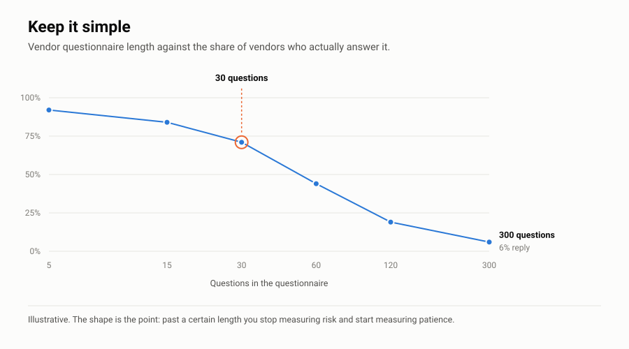

# TPRM Right-Sized

Third-party risk a mid-market company can actually run. Vendor tiering, questionnaires that fit on two pages, a scoring model, contract language, and the part nobody writes about: getting vendors to answer you at all.

Most published TPRM material is either a vendor pitch or it's built for a 10,000-person company with a dedicated team. If you've got 300 employees, 200 vendors, and one person doing this alongside three other jobs, none of it helps.

---

## Thirty Questions Beat Three Hundred

<picture>
  <source media="(prefers-color-scheme: dark)" srcset="charts/keep-it-simple-dark.svg">
  
</picture>

The 300-question vendor questionnaire doesn't measure risk. It measures patience.

Thirty good questions, answered carefully, with two or three followed up in a real conversation, will tell you more about a vendor than any long form ever written. The value is in the follow-up, not the form.

More in [PRINCIPLES.md](https://github.com/HarrisonWard/.github/blob/main/PRINCIPLES.md).

---

## The Numbers Moved

Third-party involvement in breaches went up 60% year over year, and now sits at 48% of all breaches. Roughly half.

Only 23% of third-party organizations fully remediated missing or improperly secured MFA on their cloud accounts. For weak passwords and permission misconfigurations, getting half the findings resolved took almost eight months.

Source: [Verizon 2026 Data Breach Investigations Report](https://www.verizon.com/dbir).

That's the argument for doing this at all. It's also the argument for doing it small enough that you actually finish. Half your breach risk now walks in through somebody else's front door, and a 300-question form is not going to close it.

---

## Who It's For

- Security and IT leaders at mid-market companies who own vendor risk on top of everything else
- Compliance teams answering "do you assess your vendors" for the first time
- vCISOs standing this up for a client who has nothing
- Anybody who got handed a 300-question SIG and quietly gave up

## Who It's Not For

Large enterprises with a TPRM team and a GRC platform. You need more than this.

Anybody looking for a tool. This is process and paper.

---

## The Whole Idea

**Most Vendors Don't Need Assessing.**

That's heresy in TPRM circles and it's also true. Assess everybody equally and you'll assess nobody well. The snack supplier and the payroll processor are not the same risk, and treating them the same is how programs collapse.

| Tier | What qualifies | What you do | How often |
|---|---|---|---|
| **Critical** | Holds regulated or customer data, or the business stops without them | Full questionnaire, evidence, a call | Annually |
| **Important** | Some sensitive data, or it hurts if they go down | Short questionnaire, SOC 2 review | Every 2 years |
| **Routine** | No sensitive data, easily replaced | Attestation, filed | At renewal |

Do this well and you might have 15 critical vendors out of 200. Fifteen is a number one person can handle.

---

## What's in Here

| File | What it is |
|---|---|
| `tiering.md` | Critical, important, routine, and how to tell |
| `questionnaires/critical.md` | ~30 questions. The ones that change a decision. |
| `questionnaires/important.md` | ~15 questions |
| `questionnaires/routine.md` | Five questions and "send us your SOC 2" |
| `scoring.md` | Turning answers into a rating without pretending it's precise |
| `risk-acceptance.md` | When a critical vendor fails and you need them anyway |
| `contracts/security-clauses.md` | Breach notification, subprocessors, audit rights, data return |
| `monitoring.md` | Ongoing monitoring on a budget of roughly zero |
| `chasing.md` | Getting a response out of a vendor who's ignoring you |
| `onboarding-checklist.md` | Request to approved, end to end |

This is the deep version of the vendor management slice of [Security-Program-Starter](https://github.com/HarrisonWard/Security-Program-Starter), policy 17, procedure 07, and the register template there. AI vendors get their extra questions from [ai-governance-kit](https://github.com/HarrisonWard/ai-governance-kit), and how to read the SOC 2 a vendor sends you is covered by [the bathroom problem](https://github.com/HarrisonWard/Security-Program-Starter/blob/main/mappings/soc2.md).

---

## The Part Nobody Writes About

`chasing.md`. You sent the questionnaire. Nothing came back.

Who to send it to, and it's not your account rep. Timing it against contract renewal, because that's the only leverage you've got. What to do when a vendor flat out says no. When to stop chasing the vendor and go talk to your own business owner instead. When to accept it, write it down, and move on.

This is where programs actually die. Not in the framework. In the follow-up email nobody sent.

---

## On Risk Acceptance

You're going to find a critical vendor with real problems that the business can't replace. That's normal and it isn't a failure.

Your job isn't making the risk go away. Your job is making sure the person who owns that relationship knows what they're accepting, says so in writing, and looks at it again later.

That's **51% of a Security Program Is Acknowledging the Risk**, applied to vendors. `risk-acceptance.md` covers doing it without turning it into theater.

---

## What This Isn't

Not legal advice. The contract language is a starting point for a conversation with your counsel, not something to paste into an agreement.

Third-party oversight requirements vary a lot by sector. Financial services, healthcare, and critical infrastructure all have specific obligations this doesn't cover.

Nothing here comes from a client engagement.

---

## Contributing

Want: sector-specific question sets, contract language that survived a real negotiation, monitoring that works with no budget.

Nothing client-identifiable. No vendor promotion. See [CONTRIBUTING.md](CONTRIBUTING.md).

---

## License

[CC BY 4.0](https://creativecommons.org/licenses/by/4.0/). Use it, change it, use it commercially. Just say where you got it.

© 2026 Harrison Ward

---

## Me

Cyber risk and technology exec. Built third-party and supply chain risk programs for enterprise clients as SVP in Kroll's Cyber Risk practice. Set up vendor risk from scratch as CTO of a multi-office firm.

[github.com/HarrisonWard](https://github.com/HarrisonWard) · [LinkedIn](https://linkedin.com/in/harrisonaward)

---

*Published under [these principles](https://github.com/HarrisonWard/.github/blob/main/PRINCIPLES.md). Security Shouldn't Be Paywalled.*
